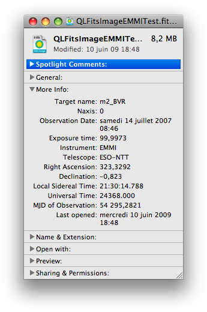
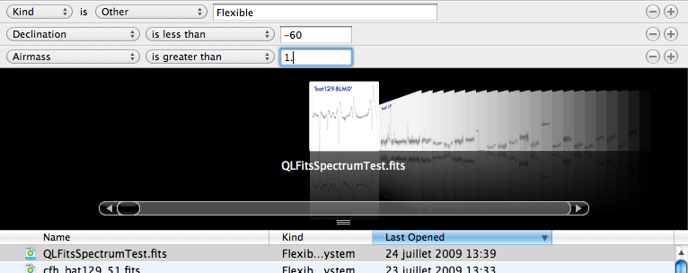

FITSImporter
============

FITSImporter is a OSX Spotlight plugin for FITS (Flexible Image transport System) files (used by astronomers worldwide to store and share their data.)

It has been originally developed by Cédric Foellmi (Soft Tenebras Lux). 

[Direct download](http://www.softtenebraslux.com/download.php?software=fitsimporter) (from the SoftTenebrasLux' website).

The following command line is run at the end of the Xcoce build phase to ensure the FITSImporter is taken into account:

    /usr/bin/mdimport -r ${HOME}/Library/Spotlight/FITSImporter.mdimporter
    
If you downloaded the binary directly, put it in:

    ${HOME}/Library/Spotlight
    
and then run the above command in your Terminal.

Once done, you can look for FITS files in your drive using Spotlight.

It is released open source under the [GNU General Public Licence](http://en.wikipedia.org/wiki/GNU_General_Public_License).

Below a typical "Get Info" panel applied to a FITS file, once FITSImporter is installed.

A typical "search" in the Finder. As you can see, you can search for FITS files using typical astronomical informations (R.A, Dec and so on).

Be careful, though the FITSImporter is not responsible for the automatic thumbnailing of the FITS images you can see (in the CoverFlow of the Finder). That's the role of [QLFits](https://github.com/SoftTenebrasLux/QLFits), the OSX QuickLook plugin for FITS files.
